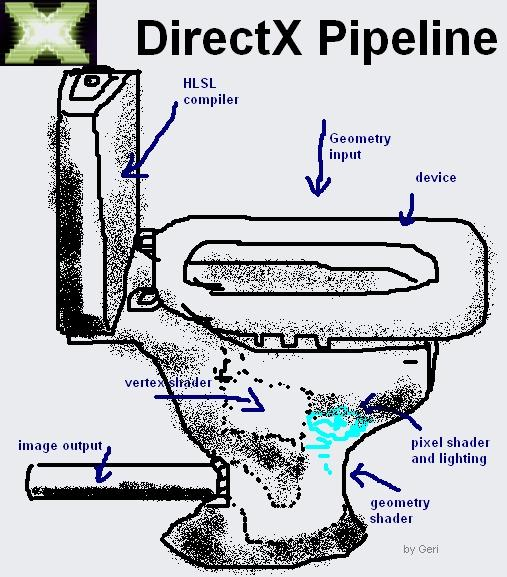

# egui-d3d9

D3D9 backend for [egui](https://github.com/emilk/egui).
Primarily intended for source games like CS:GO and GMod.

It's not perfect by far, but it'll do. This is a rewrite of a fork I had of sy1ntexx's [egui-d3d11](https://github.com/sy1ntexx/egui-d3d11). The input manager and the example code are still mostly from that repository. A lot of the general structure was inherited, as I found it quite intuitive.

Turns out, porting from D3D11 down to D3D9 is harder than *just* doing D3D9.

